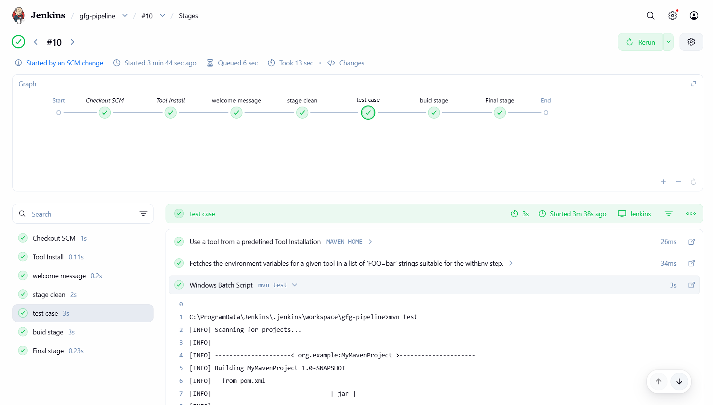
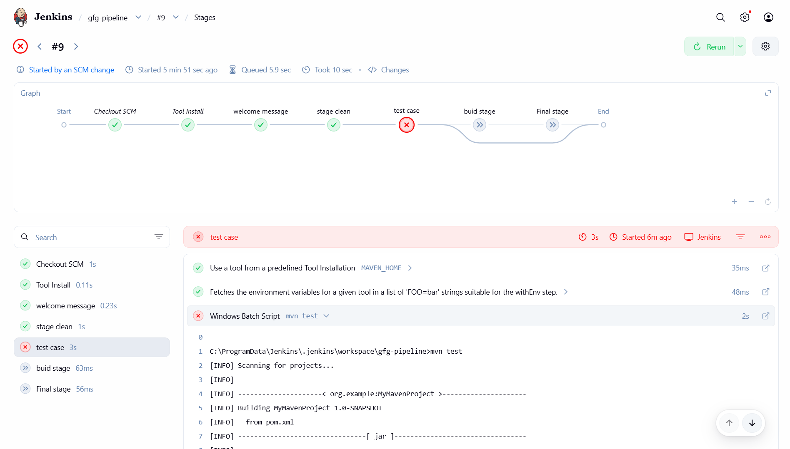

# Project Overview

This project is a Java application managed with Maven and includes a Jenkins pipeline for CI/CD automation.


## Project Structure
- **src/main/java/**: Main Java source code
- **src/test/java/**: Unit tests
- **pom.xml**: Maven build configuration
- **Jenkinsfile**: Jenkins pipeline definition
- **images/**: Contains pipeline status images

## Getting Started
1. **Build the Project**
   - Use Maven to build: `mvn clean package`
2. **Run Tests**
    - Execute tests: `mvn test`
    - Example test case:
       ```java
       // src/test/java/org/example/MainTest.java
       public void test(){
             assertEquals(15, calc.sum(10,5));
       }
       ```
3. **Continuous Integration**
   - The `Jenkinsfile` automates build and test steps using Jenkins.


## Jenkins Pipeline
- The pipeline is defined in the `Jenkinsfile` at the project root.
- Typical stages include build, test, and deploy (customizable as needed).
- To use, connect your repository to a Jenkins server with Pipeline and Maven plugins installed.

## Pipeline Status Images
Below are example images showing pipeline status according to test-case:

**Build Success When Logic is Correct [test-case]:**


**Build Failed When Logic is Wrong [test-case]:**


## Requirements
- Java (version as specified in `pom.xml`)
- Maven
- (Optional) Jenkins for CI/CD

## How to Contribute
1. Fork the repository
2. Create a feature branch
3. Commit your changes
4. Open a pull request

## License
Specify your license here (e.g., MIT, Apache 2.0, etc.)

---
For more details, see the `Jenkinsfile` and `pom.xml` in this repository.